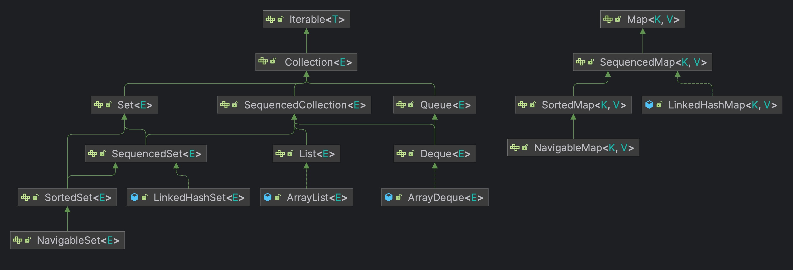

# Sequenced Collections (JEP-431)


`Collections Framework with Sequenced Interfaces and some implementations `

## SequencedCollection

```java
interface SequencedCollection<E> extends Collection<E> {

    // new method
    SequencedCollection<E> reversed();

    // methods promoted from Deque
    default void addFirst(E);

    default void addLast(E);

    default E getFirst();

    default E getLast();

    default E removeFirst();

    default E removeLast();
    
}
```

Por ejemplo, el siguiente programa crea un ArrayList y realiza algunas operaciones básica en él:

```java
public class Demo {
    public static void main(String[] args) {

        List<Integer> list = new ArrayList<>();
        list.add(2014);                         // Adds 2014 to the list.
        list.addFirst(1996);                    // Adds 1996 to the beginning of the list.
        //list.add(0, 1996);                    // Before java 21
        list.addLast(2023);                     // Adds 2023 to the end of the list.
        //list.add(2023);                       // Before java 21
        System.out.println(list);               // Output: [1996, 2014, 2023]
        System.out.println(list.getFirst());    // Output: 1996
        System.out.println(list.getLast());     // Output: 2023
        System.out.println(list.reversed());    // Output: [2023, 2014, 1996]
        System.out.println(list.removeFirst()); // Output: 1996
        //list.remove(0);                       // Before java 21
        System.out.println(list.removeLast());  // Output: 2023
        //list.remove(list.size() - 1);         // Before java 21
        System.out.println(list);               // Output: [2014]

    }
}
```

## SequencedSet

```java
interface SequencedSet<E> extends Set<E>, SequencedCollection<E> {

    @Override
    SequencedSet<E> reversed();
    
}
```

Por ejemplo, el siguiente programa crea un LinkedHashSet y realiza algunas operaciones básica en él:

```java
public class Demo {
    public static void main(String[] args) {

        LinkedHashSet<Integer> hashSet = new LinkedHashSet<>(Set.of(1996, 2014, 2018, 2021, 2023));
        System.out.println("Contents: " + hashSet);                 // Output: [2018, 1996, 2014, 2023, 2021]
        System.out.println("First element: " + hashSet.getFirst()); // Output: 2018
        System.out.println("Last element: " + hashSet.getLast());   // Output: 2021
        System.out.println("Reversed view: " + hashSet.reversed()); // Output: [2021, 2023, 2014, 1996, 2018]

    }
}
```

## SequencedMap

```java
interface SequencedMap<K, V> extends Map<K, V> {

    // new methods
    SequencedMap<K, V> reversed(); //Provides a reversed view of the map.

    default SequencedSet<Map.Entry<K, V>> sequencedEntrySet(); //Returns a SequencedSet of map entries, maintaining the encounter order.

    default SequencedCollection<V> sequencedValues(); //Returns a SequencedCollection of map values, preserving the encounter order.

    default SequencedSet<K> sequencedKeySet(); //Returns a SequencedSet of map keys, reflecting the encounter order.

    default V putFirst(K k, V v); //Inserts an entry at the beginning of the map.

    default V putLast(K k, V v); //Inserts an entry at the end of the map.

    // methods promoted from NavigableMap
    default Map.Entry<K, V> firstEntry(); //Retrieves the first entry in the map.

    default Map.Entry<K, V> lastEntry(); //Retrieves the last entry in the map.

    default Map.Entry<K, V> pollFirstEntry(); //Removes and returns the first entry in the map.

    default Map.Entry<K, V> pollLastEntry(); //Removes and returns the last entry in the map.
    
}

```

Por ejemplo, el siguiente programa crea un LinkedHashMap y realiza algunas operaciones básica en él

```java
public class Demo {
    public static void main(String[] args) {

        LinkedHashMap<Integer, String> hashMap = new LinkedHashMap<>();
        hashMap.put(2014, "1.8");
        hashMap.put(2018, "11");
        hashMap.put(2021, "17");
        hashMap.put(2023, "21");

        System.out.println("HashMap: " + hashMap);
        // Output: {2014=1.8, 2018=11, 2021=17, 2023=21}

        hashMap.putFirst(1996, "1.0");
        hashMap.putLast(2024, "22");

        System.out.println("HashMap: " + hashMap);
        // Output: {1996=1.0, 2014=1.8, 2018=11, 2021=17, 2023=21, 2024=22}

        System.out.println("Fetching first entry: " + hashMap.firstEntry());
        // Output: 2024=22

        System.out.println("Fetching last entry: " + hashMap.lastEntry());
        // Output: 2024=22

        System.out.println("Removing first entry: " + hashMap.pollFirstEntry());
        // Output: 1996=1.0

        System.out.println("Removing last entry: " + hashMap.pollLastEntry());
        // Output: 2024=22

        System.out.println("HashMap: " + hashMap);
        // Output: {2014=1.8, 2018=11, 2021=17, 2023=21}

        System.out.println("Reversed view of the map: " + hashMap.reversed());
        // Output: {2023=21, 2021=17, 2018=11, 2014=1.8}

    }
}
```